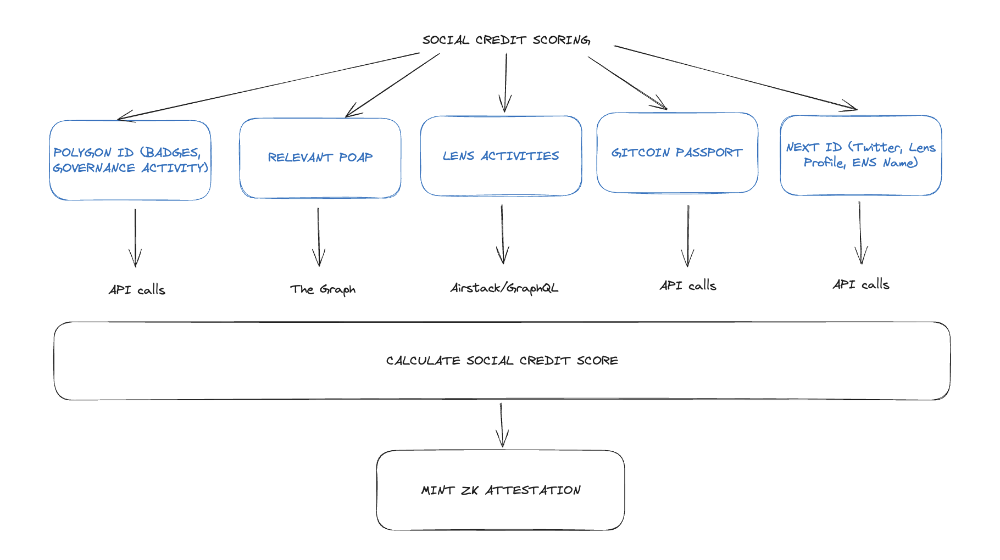
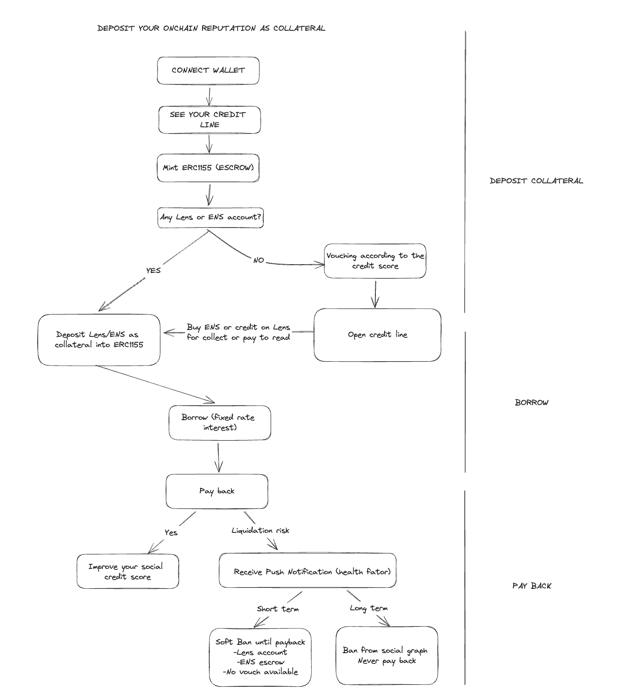
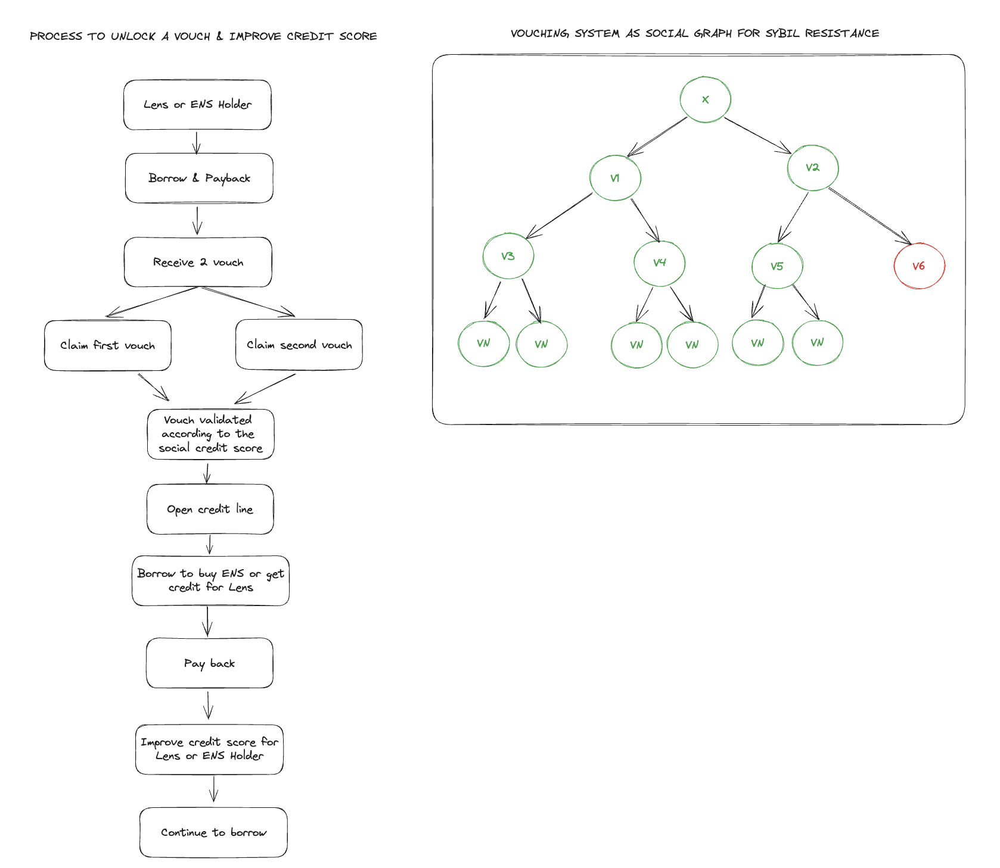

# SoFiLend 🌱


## Short Description

SoFiLend is an DeFi overcollateralised lending protocol using on-chain social profiles (Lens, ENS, etc.) as collateral for borrowing assets.

Our appplication uses smart analytics to monitor blockchain activity, generating a reputation score for each user with an advanced social graph system. Depending on the reputation score obtained by the user, he is eligible to borrow an amount of assets. 

> This project has been built during ETH Global Istanbul 2023 Hackathon. More information [here](https://ethglobal.com/events/istanbul).

- Try the application for yourself here 👉 [website](https://so-fi-front.vercel.app/)
- Watch the demo video and project page here 👉 [video](https://ethglobal.com/showcase/sofilend-fajeu)

*The project has been deployed and has leveraged the solutions of the following sponsors: 
Aave, Spark, Arbitrum, Gnosis Chain, WalletConnect, Arbitrum, Mask Network, Lens Protocol, Polygon, IPFS & Filecoin, Metamask, Chilliz, Scroll, Push Protocol, ENS, Celo, Mantle, Neon EVM, Ethereum Attestation Service, Nouns DAO*

## Problem

Current undercollateralized lending protocols struggle with effectiveness due to inadequate incentives for borrowers to ensure loan repayment. The rise of the creator economy and social finance initiatives, including on-chain social media and profiles like those offered by the Lens Protocol, signal a shift towards leveraging digital identity and reputation as potential solutions to this challenge.

## How does it work

### Collateral Deposits: Social profiles

Your Lens or ENS profiles are not just digital identities; they are tokens with inherent value based on your reputation within the ecosystem. 

### Features

- **Continued Access**: Even after depositing your Lens or ENS profiles as collateral, you maintain full access to these accounts.
- **Repayment Notifications**: As the loan repayment date nears, you'll receive push notifications about your health factor and potential liquidation risks.
- **Reclaiming Collateral**: Once you repay the loan, your deposited collateral is returned to you.

### Consequences of Non-Payment

Failure to repay the loan triggers a soft ban, imposing the following restrictions:

- **Lens**: Blocks all interactions on the platform.
- **ENS**: Funds due to you are frozen in an escrow account, which then directs the funds to the lender.
- **Vouching Limit**: Restricts vouching capabilities (up to a maximum of 2 per wallet).

## Contributors
- Solène Daviaud: [@sdaav](https://github.com/sdaav)
- Nandy Bâ: [@nandyba](https://github.com/nandyba)
- Léo Combaret: [@shimadakunn](https://github.com/Shimadakunn)
- Mathias Bougon: [@mathbgn](https://github.com/mathbgn)
- Mathis Sergent: [@mathissrgt](https://github.com/mathisrgt)

## Deployed on

**Chilliz mainnet**
````
LoanContract : 0x9E7a4e8EF0A5F7949602e2Ff71dD0FFBC4F9Db91
Asset. : 0xc81c0D879650a41d0C7A1ff588df7e11A5BFFeC4
````

**Gnosis Chain**
````
Main contract: 0x06a885610f0777c12125cba1470461cc4ca032af
AssetProof: 0x6739e925c617FD8d72Ee9466439fFF7c0d5Bef8D
````

**Polygon ZkEvm Testnet:**
````
AssetProof: 0xdF139C6B1283514472Afc5d3e0A0D52b7f64f8Ed
MainContract: 0x532E6Ce0763Da28346906E06C8C9922f3B5F479b
````

**Arbitrum Sepolia Testnet:**
````
LoanContract : 0x9E7a4e8EF0A5F7949602e2Ff71dD0FFBC4F9Db91
AssetProof : 0xf5a672774a53872e7C6773Aa04F41a7F6c37e327
````

**Scroll Asset**
````
scroll asset: 0x5f3f1dBD7B74C6B46e8c44f98792A1dAf8d69154
Loan Contract : Talked with Raza and couldn't deploy due to RPC problems
````

**Celo**
````
Asset: 0x0B15b524011cDF374B87Bd3ED0c844F8948B8608
Loan Contract : 0xe8B3CB3BF75Ae25ec97942AaAce603590DE2b668
````

**Linea**
````
LoanContract : 0x9E7a4e8EF0A5F7949602e2Ff71dD0FFBC4F9Db91
AssetProof : 0xc81c0D879650a41d0C7A1ff588df7e11A5BFFeC4
````

## Application Architecture

*Social Credit Scoring*


*On-Chain Reputation as Collateral*


*Sybil Resistant Vouching System*



